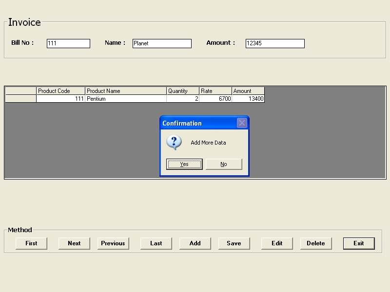



## Writable Flexgfrid Data

### Description

I think Flexgrid is Important in any Database Project.

I made Readable / Writable Flexgrid for convinience to Add / Edit Data.
 
### More Info
 

             |
---                |---
**Submitted On**   |2002-11-01 17:26:30
**By**             |[Jipal Shah](https://github.com/Planet-Source-Code/PSCIndex/blob/master/ByAuthor/jipal-shah.md)
**Level**          |Beginner
**User Rating**    |4.8 (19 globes from 4 users)
**Compatibility**  |VB 6\.0
**Category**       |[Databases/ Data Access/ DAO/ ADO](https://github.com/Planet-Source-Code/PSCIndex/blob/master/ByCategory/databases-data-access-dao-ado__1-6.md)
**World**          |[Visual Basic](https://github.com/Planet-Source-Code/PSCIndex/blob/master/ByWorld/visual-basic.md)
**Archive File**   |[Writable\_F1490801122002\.zip](https://github.com/Planet-Source-Code/jipal-shah-writable-flexgfrid-data__1-40347/archive/master.zip)

